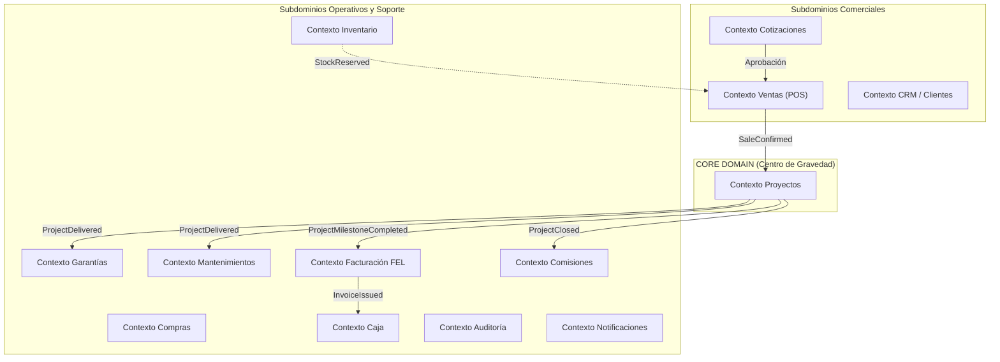
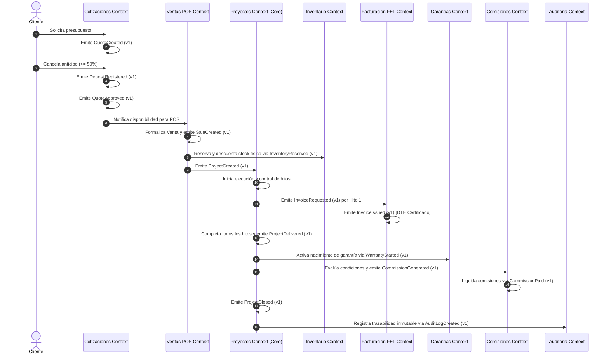
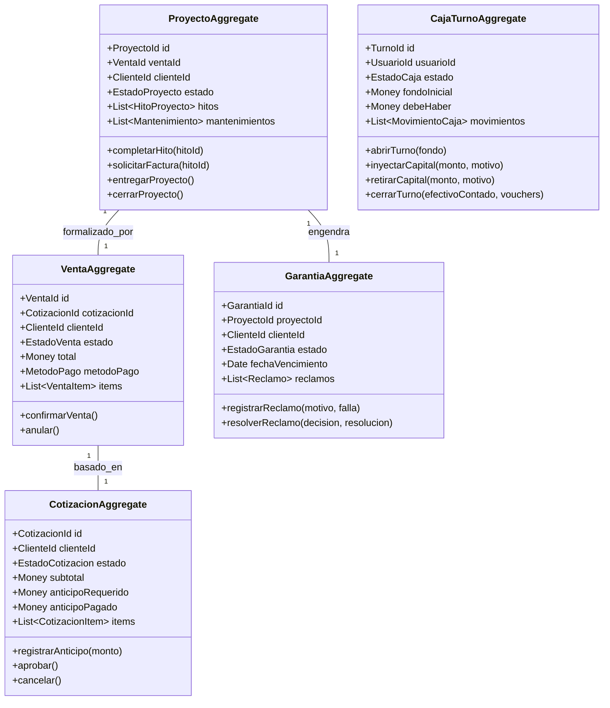
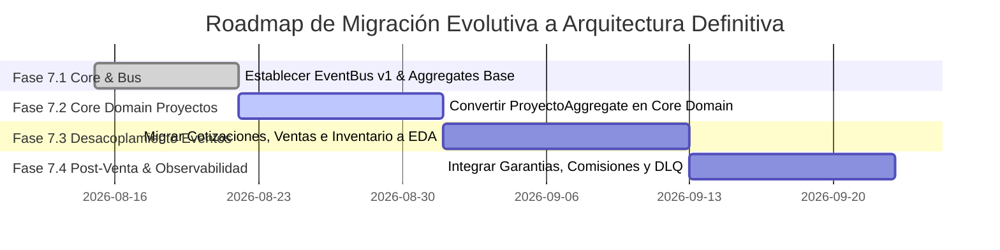

# ARQUITECTURA DEFINITIVA Y MANUAL DE GOBIERNO ARQUITECTÓNICO — WEBSOFT POS

---

## INTRODUCCIÓN Y DOCUMENTO CONSTITUCIONAL

Este documento constituye la **Especificación de Arquitectura Definitiva y Manual de Gobierno Técnico** para **WebSoft POS**. Define las reglas inviolables de ingeniería, la delimitación del dominio del negocio mediante **Domain-Driven Design (DDD)**, la arquitectura orientada a eventos (**Event-Driven Architecture - EDA**), las estructuras de agregados, el catálogo formal de reglas de negocio y la hoja de ruta evolutiva para la plataforma.

---

## SECCIÓN 1: PRINCIPIOS ARQUITECTÓNICOS ("LA CONSTITUCIÓN DEL SISTEMA")

Los siguientes principios son universales y de obligado cumplimiento para todo desarrollador, módulo o subagente que contribuya al sistema:

1. **SINGLE SOURCE OF TRUTH (ÚNICA FUENTE DE LA VERDAD)**
   Cada dato o entidad del sistema pertenece a un único Bounded Context. Ningún contexto puede mantener copias mutables ni ser dueño de datos pertenecientes a otro contexto.

2. **PROHIBICIÓN ABSOLUTA DE MODIFICACIÓN DIRECTA INTER-MÓDULO**
   Ningún servicio o módulo puede llamar métodos de mutación ni realizar operaciones de actualización directa (`UPDATE`, `DELETE`, `prisma.update`) sobre las tablas de base de datos pertenecientes a otro contexto. Todo cambio de estado inter-dominio debe ocurrir mediante la emisión y consumo de **Domain Events**.

3. **MANDATO DE TRANSICIÓN VÍA DOMAIN EVENTS**
   Toda transición de estado crítica en el negocio (aprobación de cotización, confirmación de venta, entrega de proyecto, cobro de hito, emisión de garantía, cierre de turno) DEBE publicar un evento de dominio inmutable en el `EventBus`.

4. **CERO LÓGICA DE NEGOCIO EN COMPONENTES REACT O REPOSITORIOS**
   Los componentes de la interfaz de usuario (React / Next.js Pages) son exclusivamente capas de presentación visual e interacción. Las funciones de repositorios o controladores API son meros orquestadores de transporte e infraestructura. Las invariantes y reglas de negocio residen ÚNICAMENTE en los **Aggregate Roots** y **Servicios de Dominio**.

5. **AGGREGATE ROOTS COMO ÚNICOS GUARDIANES DE ESTADO E INVARIANTES**
   Las entidades internas de un Agregado solo pueden ser modificadas a través de la raíz del Agregado (`Aggregate Root`). Ningún componente externo puede alterar el estado interno de un Agregado directamente.

6. **IDEMPOTENCIA Y TRAZABILIDAD OBLIGATORIA (CORRELATION & EVENT IDS)**
   Todo evento de dominio debe incluir un `eventId` único y un `correlationId` para rastrear la transacción completa a través de múltiples contextos. Todo escuchador de eventos (`Event Listener`) debe ser idempotente; procesar el mismo evento múltiples veces produce exactamente el mismo resultado sin efectos colaterales duplicados.

7. **AUDITORÍA COMPLETA E INMUTABLE DE CAMBIOS CRÍTICOS**
   Cualquier evento que altere dinero, stock, estado de proyectos o garantías debe registrarse automáticamente de forma inmutable en el registro de auditoría.

---

## SECCIÓN 2: DOMAIN DISCOVERY & AUDITORÍA DEL CÓDIGO ACTUAL (SECCIÓN 0)

Tras auditar la base de código actual (`src/app`, `src/modules`, `src/core`), se han detectado los siguientes patrones y discrepancias entre el estado actual y el estado ideal del dominio:

### 2.1. Análisis de Iniciadores y Terminadores de Proceso

| Proceso | Iniciador Actual | Iniciador Ideal del Dominio | Terminador Actual | Terminador Ideal del Dominio |
| :--- | :--- | :--- | :--- | :--- |
| **Cotización a Venta** | `use-pos.ts` / POS UI | `CotizacionAggregate` | `ventas/route.ts` (API Directa) | Evento `SaleCreated` consumido por `ProyectoAggregate` |
| **Generación de Proyecto** | `SaleCreatedListener` (Hook) | Evento `SaleConfirmed` | `proyecto-sync.helper.ts` | `ProyectoAggregate.initiate()` |
| **Emisión de Garantía** | Manual en `/garantias` o script | Evento `ProjectDelivered` | `GarantiaBackendService` | `GarantiaAggregate.issue()` |
| **Cobro de Hito de Proyecto** | UI Proyectos | Evento `MilestoneCompleted` | `proyectos/[id]/route.ts` | `FacturacionAggregate.issueInvoice()` |
| **Pago de Comisiones** | N/A (Lógica dispersa) | Evento `ProjectClosed` | N/A | `ComisionAggregate.calculateAndPay()` |

### 2.2. Descubrimiento de Reglas Ocultas en UI y APIs
- **Validación de Anticipo en POS**: En la interfaz del POS (`PosCart.tsx`), la comprobación de si el cliente pagó el anticipo o no se realiza de forma ad-hoc evaluando strings. **Regla Oculta**: *Una cotización requiere el 50% de anticipo para formalizarse en venta*. Debe estar encapsulada en `CotizacionAggregate.validateDeposit()`.
- **Cálculo de IVA y Ganancia en Inventario**: En `ItemFormModal.tsx`, la relación entre costo, margen e IVA vive en el frontend. Debe residir en el Value Object `UnitPrice`.
- **Generación de Órdenes de Servicio en Reclamos**: En `garantias/page.tsx`, la decisión de reparar dispara un `fetch` secundario a la API de reclamos. Debe ser un efecto secundario asíncrono activado por el evento `WarrantyClaimApproved`.

### 2.3. Estados No Controlados y Eventos Faltantes
- **Estado de Stock Reservado**: El inventario solo tiene stock físico `actual`. No existe el estado `reservado` durante la cotización/venta pendiente, ocasionando posibles sobreventas.
- **Eventos Implícitos Faltantes**: Faltan eventos explícitos como `ProjectMilestoneInvoiced`, `ProjectDelivered`, `WarrantyClaimApproved`, `CommissionApproved`, y `CajaShiftClosed`.

---

## SECCIÓN 3: DEMOSTRACIÓN TÉCNICA DEL CORE DOMAIN Y BOUNDED CONTEXTS

### 3.1. Demostración del Core Domain: ¿Por qué PROYECTOS es el Núcleo del ERP?

**Análisis Comparativo de Dominio:**
1. **Cotizaciones** es una fase de **intención**: Representa una propuesta comercial previa que puede ser modificada o descartada.
2. **Ventas** es una fase de **formalización financiera**: Registra la transacción inicial y el cobro del anticipo.
3. **Proyectos** es el **CENTRO DE GRAVEDAD DEL NEGOCIO (Core Domain)**:
   - Controla la ejecución física de las soluciones entregadas al cliente.
   - Gobierna la facturación gradual por hitos (`Milestone Invoicing`).
   - Gobierna el momento exacto en que nace la **Garantía** (únicamente tras el evento `ProjectDelivered`).
   - Gobierna la programación automática de **Mantenimientos Preventivos**.
   - Gobierna las condiciones de pago de **Comisiones** a los asesores comerciales y técnicos.
   - Gobierna la liquidación final del ciclo de vida del cliente.

**Conclusión Arquitectónica:** Toda la arquitectura de WebSoft POS gravita alrededor del ciclo de vida de **Proyectos**, utilizando Cotizaciones y Ventas como puertas de entrada de datos, e Inventario, Facturación y Caja como servicios de soporte ejecutor.

---

### 3.2. Mapa de Bounded Contexts y Data Ownership

Se delimitan 14 **Bounded Contexts** independientes:



### 3.3. Data Ownership Map (Matriz de Propiedad de Datos)

| Entidad / Dato | Creador (Owner) | Modificador Permitido | Lectores / Consultores | Mutación Prohibida Para |
| :--- | :--- | :--- | :--- | :--- |
| **Cotización** | `Cotizaciones` | `CotizacionAggregate` | Ventas, Proyectos, Caja, CRM | Ventas, Proyectos, Inventario |
| **Venta / Transacción** | `Ventas` (POS) | `VentaAggregate` | Proyectos, Caja, Auditoría, FEL | Proyectos, Inventario, Garantías |
| **Proyecto / Hitos** | `Proyectos` | `ProyectoAggregate` | Facturación, Garantías, Mantenimientos, Comisiones | Ventas, Cotizaciones, Inventario |
| **Stock / Producto** | `Inventario` | `InventarioAggregate` | POS, Ventas, Compras, Proyectos | Ventas, POS, Proyectos, Caja |
| **Turno de Caja** | `Caja` | `CajaTurnoAggregate` | POS, Facturación, Auditoría | Ventas, Proyectos, Garantías |
| **Certificado Garantía** | `Garantías` | `GarantiaAggregate` | Mantenimientos, Servicio Técnico, CRM | Ventas, Cotizaciones, Caja |
| **Comisión** | `Comisiones` | `ComisionAggregate` | Finanzas, Usuarios, RRHH | Ventas, POS, Proyectos |

---

## SECCIÓN 4: CATÁLOGO DE BUSINESS CAPABILITIES (CAPACIDADES DEL NEGOCIO)

Las capacidades se organizan jerárquicamente sin dependencia de la interfaz gráfica:

```
WebSoft POS Capabilities
│
├── 1. Gestión de Relaciones con Clientes (CRM)
│   ├── Registrar / Actualizar Cliente
│   ├── Consultar Historial Comercial
│   ├── Validar NIT / Datos Fiscales
│   └── Gestionar Créditos y Límites
│
├── 2. Gestión Comercial y Presupuestos (Cotizaciones)
│   ├── Elaborar Cotización de Productos / Servicios
│   ├── Aplicar Descuentos y Condiciones
│   ├── Registrar Anticipo Mínimo (50%)
│   └── Aprobar / Cancelar Cotización
│
├── 3. Punto de Venta y Transacciones (Ventas / POS)
│   ├── Procesar Carrito de Compra (Stock & Libre)
│   ├── Aplicar Cupones de Descuento
│   ├── Cobrar (Efectivo, Tarjeta, Transferencia, Mixto)
│   └── Formalizar Venta y Generar Ticket
│
├── 4. Gestión Central de Operaciones (Proyectos - CORE DOMAIN)
│   ├── Inicializar Proyecto desde Venta
│   ├── Programar y Controlar Hitos de Entrega
│   ├── Solicitar Facturación por Hito
│   ├── Entregar Proyecto (ProjectDelivered)
│   └── Liquidar y Cerrar Proyecto (ProjectClosed)
│
├── 5. Control de Inventario y Cadena de Suministro
│   ├── Administrar Catálogo de Productos y Precios
│   ├── Calcular Automáticamente Margen e IVA
│   ├── Reservar Stock por Venta / Cotización
│   ├── Ajustar / Transferir Inventario
│   └── Monitorear Alertas de Stock Mínimo
│
├── 6. Garantías y Post-Venta
│   ├── Emitir Certificado de Garantía (post-entrega)
│   ├── Consultar Estado de Cobertura
│   ├── Registrar y Evaluar Reclamo
│   └── Vincular Reclamo a Orden de Servicio Técnico
│
├── 7. Mantenimientos Preventivos
│   ├── Calendarizar Mantenimientos Post-Entrega
│   ├── Notificar Vencimientos al Cliente
│   └── Registrar Ejecución de Mantenimiento
│
├── 8. Control Financiero de Caja
│   ├── Abrir Turno de Caja con Fondo Inicial
│   ├── Registrar Inyecciones de Capital
│   ├── Registrar Retiros a Bodega / Banco
│   └── Ejecutar Arqueo y Cierre de Turno
│
├── 9. Facturación Electrónica (FEL DTE)
│   ├── Generar Documento Tributario Electrónico (DTE)
│   ├── Transmitir y Certificar ante la SAT
│   └── Anular DTE bajo Reglas Fiscales
│
├── 10. Gestión de Comisiones Comerciales
│   ├── Definir Reglas de Comisión por Venta / Proyecto
│   ├── Calcular Comisión al Cumplir Condiciones de Entrega
│   └── Liquidar y Pagar Comisiones
│
└── 11. Gobierno, Auditoría y Notificaciones
    ├── Registrar Bitácora Inmutable de Auditoría
    ├── Notificar Eventos Críticos por Email / Sistema
    └── Monitorear Observabilidad y Salud de Eventos
```

---

## SECCIÓN 5: EVENT STORMING & DIAGRAMA CRONOLÓGICO DE EVENTOS

A continuación se muestra el flujo cronológico definitivo de eventos desde la solicitud de cotización hasta el cierre del proyecto y pago de comisiones:



---

## SECCIÓN 6: CATÁLOGO ESTRUCTURADO DE REGLAS DE NEGOCIO (`BR-001` A `BR-012`)

### `BR-001`: Pago Mínimo de Anticipo para Aprobación
- **Descripción**: Una cotización solo puede aprobarse cuando el cliente haya abonado al menos el 50% del total.
- **Prioridad**: Alta.
- **Estado**: Obligatoria.
- **Eventos Afectados**: `QuoteDepositRegistered`, `QuoteApproved`.
- **Permite Rollback**: No (La aprobación requiere verificación previa de fondos en Caja/Banco).

### `BR-002`: Política de No Devolución de Anticipo por Cancelación
- **Descripción**: Si el cliente cancela la cotización o venta de forma posterior a la aprobación, el anticipo abonado no se devuelve bajo ninguna circunstancia y se registra como ingreso por cancelación.
- **Prioridad**: Alta.
- **Estado**: Obligatoria.
- **Eventos Afectados**: `QuoteCancelled`, `SaleCancelled`, `CancellationIncomeRegistered`.
- **Permite Rollback**: No.

### `BR-003`: Formalización Obligatoria de Cotización Aprobada a Venta
- **Descripción**: Toda cotización en estado `aprobada` debe convertirse en un registro de `Venta` con número único antes de poder iniciar operaciones en proyectos.
- **Prioridad**: Alta.
- **Estado**: Obligatoria.
- **Eventos Afectados**: `QuoteApproved`, `SaleCreated`.
- **Permite Rollback**: Sí (Sólo por anulación administrativa autorizada).

### `BR-004`: Descuento e Invariante de Inventario
- **Descripción**: Una venta formalizada debe descontar el stock disponible de productos físicos. No se permite vender ítems con stock menor a 1 a menos que sea un ítem de línea libre/servicio.
- **Prioridad**: Alta.
- **Estado**: Obligatoria.
- **Eventos Afectados**: `SaleCreated`, `InventoryStockDeducted`.
- **Permite Rollback**: Sí (En caso de anulación permitida por negocio).

### `BR-005`: Nacimiento del Proyecto desde la Venta
- **Descripción**: La creación de una venta de equipos o servicios instala automáticamente un Agregado de `Proyecto`, el cual asume el control absoluto de la ejecución.
- **Prioridad**: Muy Alta (Core Domain).
- **Estado**: Obligatoria.
- **Eventos Afectados**: `SaleCreated`, `ProjectCreated`.
- **Permite Rollback**: No (El proyecto nace e inicia su máquina de estados).

### `BR-006`: Facturación Controlada por el Flujo del Proyecto
- **Descripción**: La facturación DTE/FEL no ocurre como un proceso libre o aislado, sino como una solicitud enviada por el `ProyectoAggregate` al completar cada hito de cobro.
- **Prioridad**: Alta.
- **Estado**: Obligatoria.
- **Eventos Afectados**: `ProjectMilestoneCompleted`, `InvoiceRequested`, `InvoiceIssued`.
- **Permite Rollback**: No (El DTE emitido solo se anula mediante notas de crédito fiscales).

### `BR-007`: Nacimiento Post-Entrega de Garantías
- **Descripción**: Los certificados de garantía nacen ÚNICAMENTE cuando el proyecto alcanza el estado de entregado (`ProjectDelivered`). Las ventas en proceso o proyectos en ejecución no poseen garantía activa.
- **Prioridad**: Alta.
- **Estado**: Obligatoria.
- **Eventos Afectados**: `ProjectDelivered`, `WarrantyStarted`.
- **Permite Rollback**: No.

### `BR-008`: Calendarización Automática de Mantenimientos
- **Descripción**: Al momento de emitir la entrega del proyecto (`ProjectDelivered`), el sistema calcula y agenda automáticamente los mantenimientos preventivos a 30, 90 y 180 días.
- **Prioridad**: Media.
- **Estado**: Obligatoria.
- **Eventos Afectados**: `ProjectDelivered`, `MaintenanceScheduled`.
- **Permite Rollback**: No.

### `BR-009`: Condición de Liberación de Comisiones
- **Descripción**: Las comisiones comerciales y técnicas solo pasan a estado `liquidable` cuando el proyecto cumple el evento `ProjectDelivered` y no posee saldo pendiente de cobro.
- **Prioridad**: Alta.
- **Estado**: Obligatoria.
- **Eventos Afectados**: `ProjectDelivered`, `CommissionGenerated`, `CommissionPaid`.
- **Permite Rollback**: No.

### `BR-010`: Invariante de Caja y Apertura de Turno
- **Descripción**: Ningún cajero puede procesar ventas en POS sin contar con un turno de caja en estado `abierta`.
- **Prioridad**: Alta.
- **Estado**: Obligatoria.
- **Eventos Afectados**: `CajaShiftOpened`, `SaleCreated`.
- **Permite Rollback**: No.

### `BR-011`: Reversión Controlada de Cancelaciones
- **Descripción**: La cancelación de un proceso solo invoca revertidores (`rollbacks`) autorizados por la matriz de reglas de negocio; ítems consumidos o servicios prestados no son reversibles.
- **Prioridad**: Alta.
- **Estado**: Obligatoria.
- **Eventos Afectados**: `ProcessCancellationRequested`, `ProcessRollbackExecuted`.
- **Permite Rollback**: Limitado por matriz.

### `BR-012`: Auditoría Obligatoria de Eventos de Dominio
- **Descripción**: Todo evento de dominio procesado por el bus debe persistirse con su payload completo, `eventId`, `correlationId`, timestamp y usuario autorizador.
- **Prioridad**: Alta.
- **Estado**: Obligatoria.
- **Eventos Afectados**: Todos los Domain Events.
- **Permite Rollback**: No (Inmutable).

---

## SECCIÓN 7: CATÁLOGO DE AGREGADOS (AGGREGATE ROOTS)



### Especificación Detallada por Agregado:

#### 1. `ProyectoAggregate` (CORE DOMAIN ROOT)
- **Responsabilidad**: Controlar el ciclo de vida operativo, financiero y post-venta completo del proyecto.
- **Invariantes**: No puede entregarse si posee hitos obligatorios incompletos. No puede cerrarse si posee facturas pendientes de cobro.
- **Puede Modificar**: Estado de Hitos, Solicitudes de Facturación, Estado de Entregado, Fechas de Mantenimiento.
- **Nunca Modifica**: Stock de inventario, Saldo de caja, Datos del cliente.
- **Eventos Emitidos**: `ProjectCreated`, `ProjectMilestoneCompleted`, `ProjectDelivered`, `ProjectClosed`, `ProjectCancelled`.
- **Eventos Consumidos**: `SaleCreated`, `InvoiceIssued`, `InvoicePaid`.

#### 2. `CotizacionAggregate`
- **Responsabilidad**: Gestionar la negociación comercial previa y la recepción del anticipo del 50%.
- **Invariantes**: El anticipo abonado debe ser `>= 50%` para permitir la transición a `aprobada`.
- **Puede Modificar**: Ítems, Precios, Anticipos, Estado comercial.
- **Nunca Modifica**: Stock físico, Proyectos, Garantías, Facturas DTE.
- **Eventos Emitidos**: `QuoteCreated`, `QuoteDepositRegistered`, `QuoteApproved`, `QuoteCancelled`.
- **Eventos Consumidos**: None (Iniciador comercial).

#### 3. `VentaAggregate`
- **Responsabilidad**: Registrar la transacción del Punto de Venta (POS) y canalizar los fondos cobrados.
- **Invariantes**: El monto recibido debe ser `>=` al total cuando el método de pago es efectivo.
- **Puede Modificar**: Estado de venta, Comprobante de ticket, Detalle de ítems cobrados.
- **Nunca Modifica**: Hitos del proyecto, Cobertura de garantía, Movimientos de caja directamente.
- **Eventos Emitidos**: `SaleCreated`, `SaleCancelled`.
- **Eventos Consumidos**: `QuoteApproved`.

#### 4. `CajaTurnoAggregate`
- **Responsabilidad**: Administrar la custodia del dinero físico y digital durante el turno del cajero.
- **Invariantes**: No permite registrar ventas si el turno está cerrado. Debe calcular exactamente el Debe Haber.
- **Puede Modificar**: Saldo en caja, Registro de Inyecciones, Registro de Retiros, Cuadre de Cierre.
- **Nunca Modifica**: Inventario, Precios de productos, Proyectos.
- **Eventos Emitidos**: `CajaShiftOpened`, `CajaCapitalInjected`, `CajaCapitalWithdrawn`, `CajaShiftClosed`.
- **Eventos Consumidos**: `SaleCreated`, `InvoicePaid`.

#### 5. `GarantiaAggregate`
- **Responsabilidad**: Proteger la cobertura del cliente post-entrega y canalizar reclamos a servicio técnico.
- **Invariantes**: Solo se activa tras el evento `ProjectDelivered`. Un reclamo resuelto como `reparar` genera una Orden de Servicio Técnico.
- **Puede Modificar**: Estado de garantía, Tickets de reclamo, Vínculo a Orden de Trabajo.
- **Nunca Modifica**: Ventas pasadas, Facturas DTE, Stock general.
- **Eventos Emitidos**: `WarrantyStarted`, `WarrantyClaimRegistered`, `WarrantyClaimApproved`, `WarrantyExpired`.
- **Eventos Consumidos**: `ProjectDelivered`.

---

## SECCIÓN 8: CATÁLOGO DE CONTRATOS DE EVENTOS DE DOMINIO (DOMAIN EVENTS V1)

Todos los eventos implementan la interfaz base `DomainEvent<T>`:

```typescript
export interface DomainEvent<T = any> {
  eventId: string;
  eventType: string;
  aggregateId: string;
  aggregateType: string;
  timestamp: string;
  correlationId: string;
  version: 'v1';
  payload: T;
}
```

### Catálogo de Eventos Principales:

#### 1. `QuoteApprovedEvent` (v1)
- **Origen**: Contexto Cotizaciones.
- **Payload**:
  ```json
  {
    "quoteId": "COT-001042",
    "clienteId": 105,
    "total": 12500.00,
    "anticipoPagado": 6250.00,
    "items": [{ "productoId": 45, "cantidad": 2, "precio": 3125.00 }]
  }
  ```
- **Consumidores**: Ventas (POS), Notificaciones, Auditoría.
- **Idempotencia**: Garantizada por `quoteId`.

#### 2. `SaleCreatedEvent` (v1)
- **Origen**: Contexto Ventas (POS).
- **Payload**:
  ```json
  {
    "saleId": "VEN-009841",
    "quoteId": "COT-001042",
    "clienteId": 105,
    "total": 12500.00,
    "metodoPago": "efectivo",
    "montoRecibido": 13000.00,
    "cambio": 500.00,
    "items": [{ "productoId": 45, "cantidad": 2, "precio": 3125.00 }]
  }
  ```
- **Consumidores**: Inventario (Descuento de Stock), Proyectos (Inicialización), Caja (Abono), Auditoría.
- **Idempotencia**: Garantizada por `saleId`.

#### 3. `ProjectCreatedEvent` (v1)
- **Origen**: Contexto Proyectos (Core Domain).
- **Payload**:
  ```json
  {
    "projectId": "PROY-000312",
    "saleId": "VEN-009841",
    "clienteId": 105,
    "hitos": [{ "num": 1, "nombre": "Entrega de Equipos", "monto": 6250.00 }]
  }
  ```
- **Consumidores**: Facturación FEL, Auditoría.
- **Idempotencia**: Garantizada por `projectId`.

#### 4. `ProjectDeliveredEvent` (v1)
- **Origen**: Contexto Proyectos (Core Domain).
- **Payload**:
  ```json
  {
    "projectId": "PROY-000312",
    "clienteId": 105,
    "fechaEntrega": "2026-08-11T11:00:00Z",
    "diasGarantia": 365
  }
  ```
- **Consumidores**: Garantías (Emisión Certificado), Mantenimientos (Programación), Comisiones (Evaluación de pago), Notificaciones.
- **Idempotencia**: Garantizada por `projectId` + `fechaEntrega`.

---

## SECCIÓN 9: MATRIZ DE INTEGRACIONES ENTRE CONTEXTOS

| Origen | Destino | Tipo de Integración | Evento Activador | Modo / Sincronía | Reintentos / DLQ | Policy Rollback |
| :--- | :--- | :--- | :--- | :--- | :--- | :--- |
| **Cotizaciones** | **Ventas** | Domain Event | `QuoteApproved` | Asíncrono | Sí (3 reintentos) | Reversión estado Cotización |
| **Ventas** | **Inventario** | Domain Event | `SaleCreated` | Asíncrono | Sí (Dead Letter Queue) | Re-acreditar stock en anulación |
| **Ventas** | **Proyectos** | Domain Event | `SaleCreated` | Asíncrono | Sí (3 reintentos) | Cancelación de Proyecto |
| **Proyectos** | **Facturación** | Domain Event | `ProjectMilestoneCompleted` | Asíncrono | Sí | Nota de Crédito DTE |
| **Proyectos** | **Garantías** | Domain Event | `ProjectDelivered` | Asíncrono | Sí | Anulación de Certificado |
| **Proyectos** | **Comisiones**| Domain Event | `ProjectDelivered` | Asíncrono | Sí | Bloqueo de Comisiones |
| **Facturación** | **Caja** | Domain Event | `InvoiceIssued` | Asíncrono | Sí | Registro de nota débito/crédito |

---

## SECCIÓN 10: DIAGNÓSTICO DE DEUDA TÉCNICA Y MIGRATION MATRIX

### 10.1. Diagnóstico de Deuda Técnica Actual

| Problema Identificado | Módulos Involucrados | Impacto | Riesgo | Prioridad | Solución Definida EDA / DDD |
| :--- | :--- | :--- | :--- | :--- | :--- |
| **Llamada Directa API POS -> Inventario** | Ventas / POS -> Inventario | Alto | Alto | Alta | Sustituir llamada directa por consumo asíncrono del evento `SaleCreated`. |
| **Reglas de Anticipo en Componentes React** | Cotizaciones UI -> POS UI | Medio | Medio | Alta | Encapsular en `CotizacionAggregate.validateDeposit()`. |
| **Generación de Proyectos en Script Sync** | Ventas -> Proyectos | Alto | Alto | Muy Alta | Migrar a `ProyectoAggregate.initiateFromSale()`. |
| **Creación Manual de Garantías** | Garantías UI -> Ventas | Medio | Medio | Media | Suscribir `GarantiaAggregate` al evento `ProjectDelivered`. |

### 10.2. Migration Matrix (Matriz de Migración Evolutiva)

| Módulo / Contexto | Estado Actual | Arquitectura Destino | Prioridad | Riesgo | Estrategia de Migración |
| :--- | :--- | :--- | :--- | :--- | :--- |
| **Cotizaciones** | Acoplado vía servicios | Bounded Context Event Driven | Alta | Medio | Introducir `CotizacionAggregate` y publicar `QuoteApproved`. |
| **Ventas (POS)** | Llamadas directas inter-módulo | Bounded Context Event Driven | Alta | Alto | Adaptar controladores POS para emitir `SaleCreated` sin acoplamiento. |
| **Proyectos** | Núcleo parcial desacoplado | CORE DOMAIN AGGREGATE ROOT | Muy Alta | Alto | Convertir `ProyectoAggregate` en el eje central del ciclo de vida. |
| **Inventario** | Servicio pasivo llamado por POS | Escuchador de Eventos Idempotente | Alta | Bajo | Convertir en consumidor del bus (`SaleCreated`, `PurchaseReceived`). |
| **Garantías** | Módulo aislado con llamadas ad-hoc | Escuchador de Eventos Post-Entrega | Media | Bajo | Reaccionar a `ProjectDelivered` para emisión automática. |
| **Caja** | Servicio semi-modular | Escuchador & Agregado Financiero | Media | Bajo | Canalizar cobros vía eventos `SaleCreated` e `InvoicePaid`. |

---

## SECCIÓN 11: MARCO DE OBSERVABILIDAD, TRAZABILIDAD Y DIAGNÓSTICO

Para garantizar la observabilidad de misión crítica en producción, el sistema implementa la siguiente infraestructura de trazabilidad:

```
[Cliente / UI] 
   │ (HTTP Header: x-correlation-id: corr-8f92a1)
   ▼
[API Gateway / Next.js Route]
   │ (Injects EventId: evt-102938)
   ▼
[Domain Aggregate Root]
   │ (Publishes Domain Event with CorrelationId & EventId)
   ▼
[EventBus Logger & Audit Log Table]
   │ (Logs: Timestamp, CorrelationId, AggregateId, EventType, Payload, User)
   ▼
[Dead Letter Queue (DLQ)] <── (On failure after 3 retries)
```

### Especificación de Observabilidad:
1. **Correlation ID (`x-correlation-id`)**: Generado en el punto de entrada (UI o API) y propagado a través de todos los eventos de dominio y logs derivados.
2. **Event ID (`eventId`)**: UUID v4 único asignado a cada instancia de evento para auditoría y deduplicación en consumidores idempotentes.
3. **Queue Dead-Letter (DLQ)**: Los eventos no procesados tras 3 reintentos se mueven a la tabla `FailedEvents` para diagnóstico y re-procesamiento manual por soporte.

---

## SECCIÓN 12: ESTRATEGIA DE ESCALABILIDAD EMPRESARIAL

Aunque la arquitectura actual corre en un entorno monolítico modular (Next.js), el diseño táctico de Bounded Contexts y Event Driven Architecture deja previsto el crecimiento a escala empresarial:

1. **Soporte Multi-Sucursal (100+ Sucursales)**:
   - Los agregados `CajaTurnoAggregate` e `InventarioAggregate` incluyen la dimensión `sucursalId`.
2. **Escalabilidad de Catálogo (1M+ Productos)**:
   - Consultas de lectura descompuestas mediante patrones CQRS (Command Query Responsibility Segregation) utilizando vistas optimizadas e índices de búsqueda.
3. **Multi-Tenancy & Multi-Moneda**:
   - Encapsulamiento del Value Object `Money` (`monto: number, moneda: 'GTQ' | 'USD'`).
   - Todos los contextos soportan `tenantId` en sus schemas de eventos e invariantes.
4. **Despliegue a Microservicios**:
   - Dado que los Bounded Contexts interactúan ÚNICAMENTE vía contratos de eventos (`v1`), cada contexto puede ser extraído a su propio microservicio de forma transparente sin alterar el contrato.

---

## SECCIÓN 13: ROADMAP DE IMPLEMENTACIÓN EVOLUTIVA (FASES 7.1 - 7.4)



### Hitos del Roadmap:
- **Hito 1 (Fase 7.1)**: Formalizar el `EventBus` con soporte para `CorrelationID`, idempotencia y registro inmutable en auditoría.
- **Hito 2 (Fase 7.2)**: Establecer `ProyectoAggregate` como el centro de control del dominio.
- **Hito 3 (Fase 7.3)**: Eliminar llamadas directas entre POS, Inventario y Facturación, canalizándolas a través de eventos `v1`.
- **Hito 4 (Fase 7.4)**: Desplegar el marco de observabilidad (DLQ), emisión post-entrega de garantías y cálculo de comisiones.

---

## CONCLUSIÓN

Este **Manual de Gobierno Arquitectónico** constituye la norma técnica suprema para WebSoft POS. Garantiza que cualquier evolución futura preserve el desacoplamiento de dominios, la integridad de las reglas de negocio y la trazabilidad operativa, asegurando una plataforma empresarial estable y escalable.
