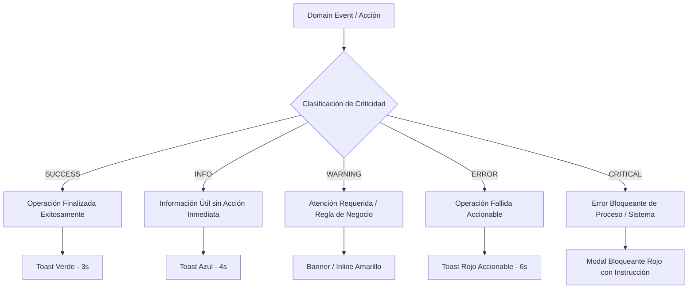
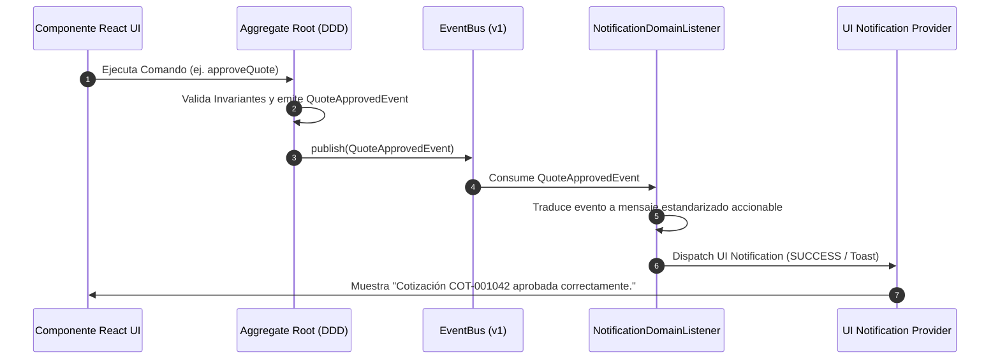
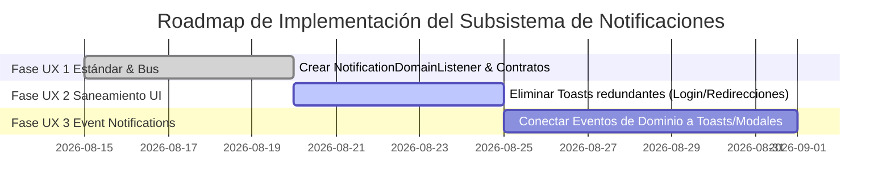

# ARQUITECTURA UX Y SISTEMA DE NOTIFICACIONES INTELIGENTES — WEBSOFT POS

---

## INTRODUCCIÓN Y MARCO CONCEPTUAL

Este documento establece la **Arquitectura UX y Especificación Técnica del Subsistema de Notificaciones Inteligentes** para **WebSoft POS**. Rediseña la experiencia de notificaciones del sistema para transformarla de un conjunto reactivo ad-hoc de Toasts en un subsistema inteligente orientado al dominio mediante **Domain-Driven Design (DDD)** y **Event-Driven Architecture (EDA)**.

El objetivo central es eliminar la contaminación visual, remover mensajes redundantes o ambiguos, proteger al usuario final de mensajes técnicos o códigos de error crípticos, y estandarizar la respuesta del sistema bajo principios estrictos de Usabilidad (UX) y Gobierno Técnico.

---

## SECCIÓN 1: PRINCIPIOS ARQUITECTÓNICOS Y DE USABILIDAD (UX)

Los siguientes principios rigen el comportamiento de todas las notificaciones en WebSoft POS:

1. **NOTIFICACIONES COMO OBSERVADORES DE DOMAIN EVENTS**
   Las notificaciones principales del sistema no deben ser disparadas manualmente desde handlers visuales en componentes React, sino que se derivan automáticamente como escuchadores asíncronos de eventos publicados en el `EventBus` (`QuoteApproved`, `SaleCreated`, `ProjectDelivered`, `WarrantyStarted`, `CajaShiftClosed`).

2. **CERO DETALLES TÉCNICOS EXPUESTOS AL USUARIO FINAL**
   Bajo ninguna circunstancia se debe mostrar un stack trace, error de SQL, excepción de Prisma o código de fallo técnico en la interfaz de usuario. Los mensajes presentados al usuario son 100% orientados al negocio, comprensibles y accionables. Toda la información técnica detallada se canaliza exclusivamente al logger de sistema (`ConsoleLogger` / Correlation ID).

3. **CERO NOTIFICACIONES REDUNDANTES**
   - **Prohibición de Toast en Login**: Tras un inicio de sesión exitoso, el sistema realiza la redirección inmediata al dashboard sin desplegar un Toast de "Login exitoso".
   - **Prohibición de Toast en Navegación Inmediata**: Si una acción desencadena un cambio inmediato de pantalla donde la nueva interfaz refleja el resultado (ej. al abrir un detalle recién creado), no se muestra un Toast redundante.
   - **Prohibición de Mensajes Genéricos**: Queda prohibido usar textos como "Proceso completado", "Guardado", "Error" o "No fue posible". Cada mensaje especifica exactamente qué ocurrió.

4. **MENSAJES SIEMPRE ACCIONABLES**
   Todo mensaje de advertencia (`WARNING`) o error (`ERROR` / `CRITICAL`) debe explicar de forma transparente la causa del evento y la acción correctiva que el usuario debe ejecutar para continuar.

5. **DESACOPLAMIENTO ENTRE INTERFAZ, LOGS Y AUDITORÍA**
   - **UI**: Presenta la notificación visual adecuada (Toast, Modal, Banner, Inline).
   - **System Logs**: Registra el evento técnico con su `eventId`, `correlationId`, stack trace y timestamp.
   - **AuditLog**: Persiste la transacción inmutable en base de datos para trazabilidad legal y financiera.

---

## SECCIÓN 2: AUDITORÍA DEL CÓDIGO ACTUAL (MÓDULOS DE NOTIFICACIÓN)

Tras auditar la base de código actual (`src/app`, `src/modules`), se ha diagnosticado la siguiente distribución y oportunidad de mejora en el manejo de notificaciones:

### 2.1. Diagnóstico de Notificaciones Actuales

| Módulo / Componente | Notificación Actual | Diagnóstico de UX | Acción de Arquitectura UX |
| :--- | :--- | :--- | :--- |
| **Auth / Login (`auth.ts`)** | Toast "Login exitoso" / Redirección | Redundante. Genera fricción visual innecesaria antes de redirigir. | **Eliminar Toast**. Ejecutar redirección inmediata. |
| **POS (`use-pos.ts`)** | `toast.success('Venta completada')` | Mensaje genérico. No especifica el número de comprobante emitido. | Transformar a: `"Venta FAC-001042 procesada correctamente."` |
| **Cotizaciones (`CotizacionFormModal.tsx`)** | `toast.success('Guardado')` | Ambiguo. No aclara si quedó en borrador o fue aprobada. | Transformar a: `"Cotización COT-001042 registrada en borrador."` |
| **Cotizaciones (`cotizacion.service.ts`)** | Error de anticipo genérico | Excepción técnica mostrada en pantalla. | Transformar a mensaje accionable de regla de negocio (`BR-001`). |
| **Garantías (`GarantiasModule.tsx`)** | `toast.success('Actualizado')` | Genérico y no especifica el cambio de estado. | Transformar a: `"Reclamo de garantía actualizado correctamente."` |
| **Caja (`CajaModule.tsx`)** | `toast.error('No hay caja abierta')` | Correcto en intención, pero requiere canalización como regla `BR-010`. | Modal o Toast persistente orientando a abrir turno de caja. |

---

## SECCIÓN 3: CLASIFICACIÓN FORMAL POR CRITICIDAD

Las notificaciones del sistema se clasifican rigurosamente en 5 niveles de criticidad:



### Detalle de Niveles de Criticidad:

#### 1. `SUCCESS` (Verde)
- **Propósito**: Confirmar la finalización exitosa de una operación solicitada por el usuario.
- **Duración**: 3 segundos (desaparición automática).
- **Ejemplo**: `"Venta FAC-001042 registrada y comprobante generado."`

#### 2. `INFO` (Azul)
- **Propósito**: Proveer contexto operativo útil que no requiere acción inmediata del usuario.
- **Duración**: 4 segundos.
- **Ejemplo**: `"Mantenimiento preventivo agendado automáticamente para el 15/09/2026."`

#### 3. `WARNING` (Amarillo)
- **Propósito**: Advertir sobre situaciones que requieren la atención del usuario antes de proceder.
- **Duración**: Persistente o Banner de cabecera.
- **Ejemplo**: `"El producto Laptop HP posee únicamente 2 unidades en inventario disponible."`

#### 4. `ERROR` (Rojo)
- **Propósito**: Comunicar la falla de una operación indicando la causa exacta y los pasos para corregirla.
- **Duración**: 6 segundos con botón de reintento.
- **Ejemplo**: `"No fue posible certificar la factura FEL ante la SAT. Verifique su conexión a Internet e intente nuevamente."`

#### 5. `CRITICAL` (Rojo Oscuro Bloqueante)
- **Propósito**: Informar sobre un error grave que compromete la integridad del proceso o la sesión.
- **Visualización**: **Modal Bloqueante** que requiere acción explícita.
- **Ejemplo**: `"Turno de caja cerrado. Es obligatorio abrir un turno de caja para poder registrar ventas en el Punto de Venta."`

---

## SECCIÓN 4: MATRIZ DE COMPONENTES VISUALES (UX MATRIX)

La siguiente matriz define de forma vinculante qué componente visual de la interfaz debe utilizarse según el escenario operativo del ERP:

| Escenario Operativo del ERP | Criticidad | Componente Visual | Duración / Comportamiento | Acción Requerida |
| :--- | :--- | :--- | :--- | :--- |
| **Venta Registrada en POS** | `SUCCESS` | **Toast** | 3 Segundos | Ninguna |
| **Cotización Guardada en Borrador** | `SUCCESS` | **Toast** | 3 Segundos | Ninguna |
| **Aprobación de Cotización (`BR-001`)** | `SUCCESS` | **Toast** | 4 Segundos | Muestra botón ver proyecto |
| **Abono / Anticipo Registrado** | `SUCCESS` | **Toast** | 3 Segundos | Imprimir recibo |
| **Validación de Anticipo Insuficiente (< 50%)** | `WARNING` | **Inline / Modal** | Hasta corregir | Ingresar monto de anticipo válido |
| **Intento de Venta con Caja Cerrada (`BR-010`)** | `CRITICAL` | **Modal** | Bloqueante | Redirige a Apertura de Caja |
| **Stock Insuficiente en Carrito POS** | `WARNING` | **Inline** | Permanente en línea de ítem | Ajustar cantidad solicitada |
| **Confirmación de Cancelación de Cotización** | `WARNING` | **Modal** | Bloqueante | Confirmación explícita con PIN |
| **Error de Certificación FEL (SAT)** | `ERROR` | **Toast con Reintento** | 6 Segundos | Reintentar emisión |
| **Advertencia de Licencia / Mantenimiento** | `INFO` | **Banner** | Permanente superior | Cerrar aviso |
| **Orden de Servicio Técnico Generada** | `SUCCESS` | **Toast** | 4 Segundos | Ver Orden de Trabajo |

---

## SECCIÓN 5: ESTÁNDAR GRAMATICAL Y CATÁLOGO DE MENSAJES

### 5.1. Reglas de Estilo y Gramática
1. **Voz Activa y Tercera Persona**: Usar el objeto de negocio como sujeto (ej. *"La cotización COT-001..."* en lugar de *"Aprobaste la cotización..."*).
2. **Especificidad**: Incluir siempre los identificadores o números de documento involucrados (`FAC-XXXXXX`, `COT-XXXXXX`, `PROY-XXXXXX`).
3. **Causalidad y Solución**: Todo mensaje de error consta de dos partes: **Qué ocurrió** + **Qué debe hacer el usuario**.

### 5.2. Catálogo Comparativo ("Incorrecto vs Correcto")

| Tipo | Mensaje Incorrecto (Prohibido) | Mensaje Correcto (Estándar Definitivo) |
| :--- | :--- | :--- |
| **Login** | `"Login exitoso."` | **Nulo** (Redirección directa e inmediata al Dashboard). |
| **Venta POS** | `"Proceso completado."` | `"Venta FAC-001042 registrada y comprobante emitido correctamente."` |
| **Cotización** | `"Guardado."` | `"Cotización COT-001042 guardada en estado borrador."` |
| **Anticipo** | `"Error de anticipo."` | `"No es posible aprobar la cotización. Se requiere un anticipo mínimo del 50% (Q 2,500.00). Monto abonado: Q 1,000.00."` |
| **Caja** | `"No se puede vender."` | `"No existe un turno de caja abierto. Abra un turno de caja antes de realizar ventas en el POS."` |
| **Inventario** | `"Sin stock."` | `"El producto 'Monitor Dell 27' solo posee 2 unidades disponibles. Ajuste la cantidad en el carrito."` |
| **FEL / DTE** | `"Error HTTP 500 en API."` | `"No fue posible certificar la factura ante la SAT. El comprobante fue guardado localmente para reintento automático."` |
| **Garantía** | `"Garantía creada."` | `"Certificado de garantía GAR-000102 emitido automáticamente tras la entrega del proyecto PROY-000045."` |

---

## SECCIÓN 6: INTEGRACIÓN CON DDD & EVENTBUS

Las notificaciones dejan de emitirse manualmente desde el código de la UI y pasan a ser impulsadas por los eventos del dominio emitidos por los Aggregate Roots:



### Contrato del Listener de Notificaciones de Dominio (`NotificationDomainListener`):

```typescript
export interface DomainNotification {
  id: string;
  level: 'SUCCESS' | 'INFO' | 'WARNING' | 'ERROR' | 'CRITICAL';
  title: string;
  message: string;
  actionLabel?: string;
  actionUrl?: string;
  timestamp: string;
  correlationId: string;
}
```

---

## SECCIÓN 7: SEPARACIÓN ENTRE UI, LOGS DE SISTEMA Y AUDITORÍA

Para mantener la seguridad y limpieza del sistema, los eventos generan tres salidas independientes:

```
[Domain Event / Excepción]
       │
       ├──► 1. UI Notification Layer (Para el Usuario)
       │       └── Mensaje amigable, accionable, 0 código técnico.
       │
       ├──► 2. ConsoleLogger / AppLogs (Para los Desarrolladores/Soporte)
       │       └── Stack trace completo, Correlation ID, Event ID, Payload JSON.
       │
       └──► 3. AuditLog Table (Para Gobierno / Finanzas)
               └── Registro inmutable de la transacción (Usuario, Fecha, IP, Monto).
```

---

## SECCIÓN 8: MATRIZ DE MIGRACIÓN Y ROADMAP EVOLUTIVO

### 8.1. Matriz de Migración de Componentes Visuales

| Módulo Actual | Estado de Notificación Actual | Estado Destino UX | Estrategia de Migración |
| :--- | :--- | :--- | :--- |
| **Auth / Login** | Toast manual al ingresar | Redirección sin Toast | Eliminar llamada a `toast` en `use-auth.ts`. |
| **POS (Nueva Venta)** | Toast genérico | Event-Driven Toast accionable | Conectar `NotificationDomainListener` al evento `SaleCreated`. |
| **Cotizaciones** | Toast ad-hoc en modal | Toast/Modal accionable | Conectar a `QuoteApproved` y `QuoteDepositRegistered`. |
| **Proyectos** | Notificación dispersa | Banners e Inline contextuales | Conectar a `ProjectDelivered` y `ProjectMilestoneCompleted`. |
| **Garantías** | Toasts manuales | Event-Driven Toast de post-venta | Conectar a `WarrantyStarted` y `WarrantyClaimApproved`. |

### 8.2. Roadmap de Implementación (Fases UX 1 - UX 3)



---

## CONCLUSIÓN

Esta **Especificación de Arquitectura UX y Sistema de Notificaciones Inteligentes** transforma las notificaciones de WebSoft POS en un canal claro, elegante y profesional. Garantiza que el usuario reciba información útil y accionable sin redundancias ni fricción visual, mientras el sistema mantiene la trazabilidad técnica e inmutable mediante logs y auditorías.
