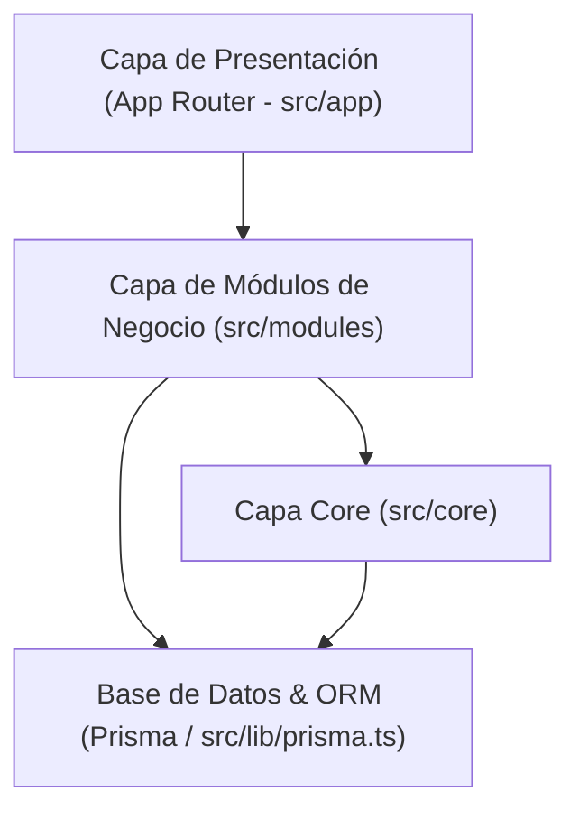
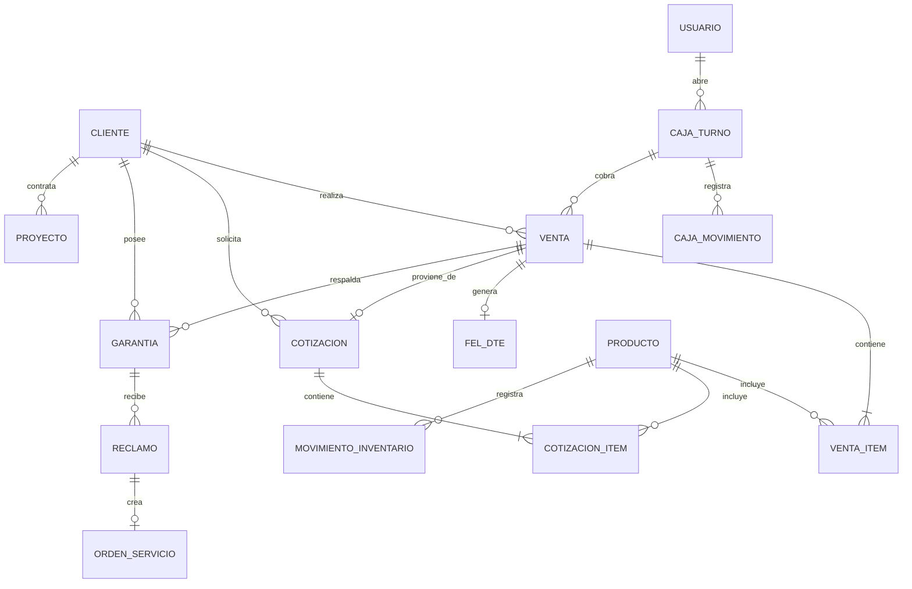
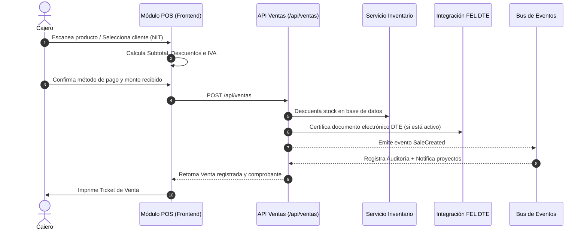

# Reporte de Arquitectura, Procesos y Relaciones — WebSoft POS

Este documento detalla la estructura arquitectónica, el flujo de datos, los procesos de negocio integrados y las relaciones entre entidades de la plataforma **WebSoft POS**.

---

## 1. Visión General y Stack Tecnológico

WebSoft POS está construido bajo una arquitectura modular desacoplada basada en eventos (Event-Driven Architecture) con Next.js (App Router), TypeScript y Prisma ORM.

### Tecnologías Principales:
- **Framework Web & API**: Next.js (App Router) + React (TypeScript).
- **Persistencia de Datos**: Prisma ORM con PostgreSQL / MySQL.
- **Autenticación & Sesiones**: NextAuth.js con control de roles (`admin`, `supervisor`, `cajero`, `tecnico`).
- **Sistema de Eventos**: Core EventBus distribuido para desacoplamiento de procesos secundarios (auditoría, sincronización de proyectos, alertas de mantenimiento).
- **Estilos & UI**: CSS Vanilla y Tokens de diseño responsivo.

---

## 2. Estructura Arquitectónica del Proyecto

La estructura del código está organizada en tres capas concéntricas principales:

### 2.1. Capa Core (`src/core/`)
Contiene los componentes transversales y las reglas del dominio global:
- **`events/`**: Bus de eventos del dominio (`EventBus`, `DomainEvent`, notificadores).
- **`state/`**: Máquinas de estado y `TransitionMap` para el flujo de vida de cotizaciones, proyectos y garantías.
- **`rules/`**: Motor de reglas (`RuleEngine`) para validaciones de negocio e inventario.
- **`cancellations/`**: Gestor unificado de anulaciones y cancelaciones con reversión de stock.
- **`inventory/`**: Escuchadores y calculadores automáticos de precios, IVA y márgenes de ganancia.

### 2.2. Capa de Módulos (`src/modules/`)
Cada módulo representa un dominio del negocio encapsulado en `services`, `hooks`, `components`, `types` y `listeners`:
- **`pos` / `ventas`**: Registro de ventas en caja, cobro en efectivo/tarjeta/transferencia, cálculo de cambio, cupones y emisión DTE/FEL.
- **`inventario`**: Gestión de productos, cálculo automático de porcentaje de ganancia e IVA, categorías, alertas de stock mínimo.
- **`cotizaciones`**: Generador de presupuestos, envío por correo, aprobación y facturación directa en POS.
- **`garantias`**: Emisión de certificados de garantía, control de vencimiento, registro de reclamos y vinculación a órdenes de servicio.
- **`caja`**: Apertura de turno con fondo inicial, movimientos de capital (inyecciones y retiros), cuadre físico y cierre de caja.
- **`proyectos`**: Seguimiento de proyectos, cobro por hitos y programación automática de mantenimientos preventivos.
- **`auditoria`**: Registro centralizado de auditoría para trazabilidad de operaciones.

---

## 3. Diagrama de Relaciones entre Entidades (ERD)

---

## 4. Procesos de Negocio Principales

### 4.1. Proceso de Venta Directa en POS

### 4.2. Proceso de Cotización a Venta y Proyecto
1. **Creación**: Se genera la cotización con precios e ítems del inventario o líneas libres.
2. **Aprobación**: Al ser aceptada, emite el evento `QuotationApproved`.
3. **Carga en POS**: El cajero carga la cotización en el POS mediante el botón "Facturar desde Cotización".
4. **Conversión**: La venta descuenta el stock de los productos vinculados y marca la cotización como `facturada`.
5. **Vinculación a Proyecto**: Si la cotización contenía servicios o mantenimientos, el evento `SaleCreatedListener` crea automáticamente el proyecto correspondiente con sus fechas de mantenimiento programadas.

### 4.3. Proceso de Garantías y Reclamos
1. **Emisión**: Al concretar una venta o de forma manual, se genera el certificado con número único (`GAR-000001`) y días de vigencia.
2. **Consulta**: El panel de Garantías permite filtrar en tiempo real por estado (`Vigentes`, `Reclamadas`, `Vencidas`, `Anuladas`) y por datos del cliente o producto.
3. **Registro de Reclamo**: Si el cliente presenta una falla dentro del período de vigencia, se abre un ticket de reclamo indicando el defecto y si adjunta factura.
4. **Resolución & Servicio Técnico**: Si la decisión del técnico es `reparar`, el sistema crea automáticamente una **Orden de Servicio Técnico** (`ordenTrabajoId`), integrando la post-venta con el departamento de servicio.

### 4.4. Proceso de Control y Arqueo de Caja
1. **Apertura de Turno**: Se requiere ingresar el fondo inicial de efectivo al iniciar el día.
2. **Operación Diaria**: Las ventas en efectivo se acreditan automáticamente al saldo "Debe Haber" de la caja activa.
3. **Inyecciones y Retiros**: Permite agregar efectivo para cambio adicional o retirar montos a bodega/banco con motivo justificado.
4. **Arqueo y Cierre**: Al finalizar el turno, el usuario ingresa el conteo físico de efectivo, vouchers de tarjeta y transferencias. El sistema compara contra el registro del sistema y calcula faltantes o sobrantes.

---

## 5. Event Bus y Arquitectura de Eventos

Todos los módulos publican y escuchan eventos a través del `EventBus` centralizado en `src/core/events`:

| Evento del Dominio | Emisor | Escuchadores (`Listeners`) | Acción Resultante |
| :--- | :--- | :--- | :--- |
| `SaleCreated` | `VentasBackendService` | `SaleCreatedListener`, `AuditListener` | Actualiza estado de cotización, crea proyecto si aplica y registra auditoría. |
| `QuotationApproved` | `CotizacionesService` | `QuotationApprovedListener` | Sincroniza estado para disponibilidad de facturación en POS. |
| `ProjectInvoiced` | `ProyectosService` | `ProjectInvoicedListener` | Actualiza estado del hito en el proyecto y genera comprobante. |
| `InventoryEvent` | `InventarioService` | `InventoryEventListener` | Audita ajustes de stock y notifica alertas de nivel mínimo. |

---

## 6. Conclusión y Estado del Sistema

La arquitectura de WebSoft POS proporciona:
- **Desacoplamiento Modular**: Cada dominio (`ventas`, `inventario`, `garantias`, `caja`, `proyectos`) funciona con independencia sin acoplamiento rígido.
- **Trazabilidad Completa**: Todo movimiento de dinero, ventas, reclamos o cambios de stock queda registrado en la bitácora de auditoría.
- **Cumplimiento de Reglas de Oro**: Código libre de emojis y conservación estricta del diseño visual del POS.
